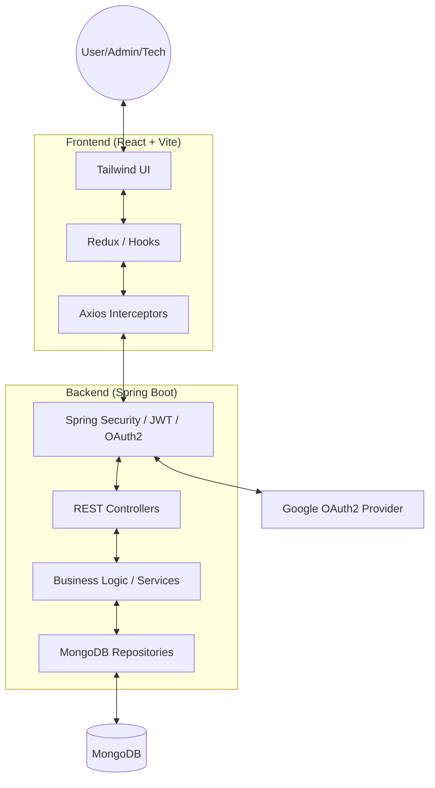

# 🎓 SMART CAMPUS OPERATIONS HUB

Professional full-stack university operations system for managing facilities, bookings, maintenance, and notifications.

## 🚀 Key Features
- **Facilities Catalogue**: Searchable database of halls, labs, and equipment.
- **Booking System**: Request-approval workflow with automatic conflict prevention.
- **Incident Ticketing**: Multi-attachment maintenance reporting with technician assignment and real-time comments.
- **Role-Based Access**: Granular control for Users, Admins, and Technicians.
- **Modern Auth**: Traditional JWT login alongside Google OAuth2 integration.
- **Notifications**: Real-time per-user alerts for booking and ticket updates.

## 🏗️ System Architecture

## 🛠️ Tech Stack
- **Backend**: Java 21 + Spring Boot 3.4
- **Database**: MongoDB (Atlas/Local)
- **Frontend**: React 18 + Vite + Tailwind CSS
- **Security**: JWT + Spring Security + OAuth 2.0 (Google)
- **Testing**: JUnit 5 + Mockito + MockMvc
- **API Docs**: Swagger / OpenAPI 3.0

## 📡 REST API Reference

| Method | Endpoint | Description | Roles |
| :--- | :--- | :--- | :--- |
| **Resources** | | | |
| `GET` | `/api/v1/resources` | List/Filter all campus resources | ALL |
| `POST` | `/api/v1/resources` | Create a new bookable resource | ADMIN |
| `PUT` | `/api/v1/resources/{id}` | Update resource details | ADMIN |
| **Bookings** | | | |
| `POST` | `/api/v1/bookings` | Request a new resource booking | USER, ADMIN |
| `PATCH` | `/api/v1/bookings/{id}/approve` | Approve a booking request | ADMIN |
| **Tickets** | | | |
| `POST` | `/api/v1/tickets` | Report an incident (with image upload) | USER, ADMIN |
| `PATCH` | `/api/v1/tickets/{id}/status` | Update progress (e.g. RESOLVED) | ADMIN, TECH |
| **Profile** | | | |
| `GET` | `/api/v1/profile/me` | Fetch detailed user profile | ALL |

*For a full list of over 40+ endpoints, see the [Postman Collection](file:///c:/Users/hp/Desktop/PAF/smart-campus-operations-hub/docs/smart_campus_api.postman_collection.json).*

## 🏁 Quick Start

### Backend
1. Configure `.env` from `backend/.env.example`.
2. Run `mvn spring-boot:run` in `backend/`.

### Frontend
1. Configure `.env` from `frontend/.env.example`.
2. Run `npm install` and `npm run dev` in `frontend/`.

## 📜 Documentation
- **Technical Blueprint**: [PROJECT_BLUEPRINT.md](file:///c:/Users/hp/Desktop/PAF/smart-campus-operations-hub/docs/PROJECT_BLUEPRINT.md)
- **Postman Collection**: [Postman JSON](file:///c:/Users/hp/Desktop/PAF/smart-campus-operations-hub/docs/smart_campus_api.postman_collection.json)

