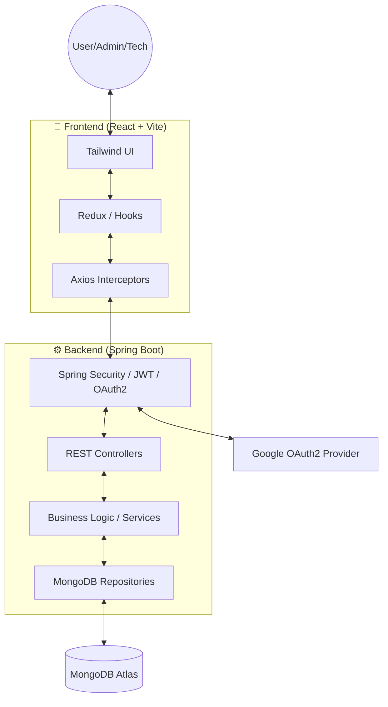

<div align="center">


# 🎓 Smart Campus Operations Hub

### **Premium Full-Stack University Operations Ecosystem**

[](https://www.oracle.com/java/)
[](https://spring.io/projects/spring-boot)
[](https://www.mongodb.com/)
[](https://react.dev/)
[](https://tailwindcss.com/)
[](./LICENSE)

---

A sophisticated, full-stack university operations system designed to streamline faculty management, resource bookings, maintenance reporting, and real-time communications. Built with a premium **Professional Glassmorphic** UI and a robust, secure Spring Boot backend to deliver a world-class campus experience.

[**Features**](#-features) • [**Tech Stack**](#-tech-stack) • [**Architecture**](#-system-architecture) • [**API Reference**](#-rest-api-reference) • [**Quick Start**](#-quick-start)

</div>

---

## ✨ Features

### 🎯 Core Operational Modules
| Module | Description |
|:---|:---|
| **🏢 Facilities Catalogue** | Advanced searchable database of halls, labs, and equipment with real-time availability status |
| **📅 Booking Engine** | Intelligent request-approval workflow featuring automated conflict prevention and multi-tier scheduling |
| **🛠️ Incident Ticketing** | High-fidelity maintenance reporting with multi-attachment support, technician assignment, and live commenting |
| **🔐 Role-Based Access** | Precision granular controls (RBAC) specifically tailored for Users, Admins, and Technicians |
| **🛡️ Modern Security** | Enterprise-grade JWT authentication seamlessly integrated with Google OAuth2 for frictionless login |
| **🔔 Real-Time Alerts** | Persistent per-user notification system for immediate booking status updates and ticket progress alerts |

---

## 🏗️ System Architecture



---

## 🛠️ Tech Stack

### Frontend & UI
| Technology | Purpose |
|:---|:---|
| **React 18** | High-Performance SPA & Component-based UI |
| **Vite** | Modern, Ultra-Fast Build Tooling |
| **Tailwind CSS** | Premium Utility-First Responsive Styling |
| **Redux Toolkit** | Centralized Application State Management |

### Backend & Database
| Technology | Purpose |
|:---|:---|
| **Java 21** | Modern, Type-Safe Enterprise Language |
| **Spring Boot 3.4** | Robust Microservice-Ready Core Framework |
| **MongoDB Atlas** | Scalable, Document-Oriented Cloud Database |
| **Spring Security** | JWT & OAuth 2.0 Identity Governance |
| **Swagger / OpenAPI 3.0** | Interactive API Documentation |

---

## 📡 REST API Reference

| Method | Endpoint | Description | Roles |
| :--- | :--- | :--- | :--- |
| **Resources** | | | |
| `GET` | `/api/v1/resources` | List/Filter all campus resources | ALL |
| `POST` | `/api/v1/resources` | Create a new bookable resource | ADMIN |
| `PUT` | `/api/v1/resources/{id}` | Update resource details | ADMIN |
| **Bookings** | | | |
| `POST` | `/api/v1/bookings` | Request a new resource booking | USER, ADMIN |
| `PATCH` | `/api/v1/bookings/{id}/approve` | Approve a booking request | ADMIN |
| **Tickets** | | | |
| `POST` | `/api/v1/tickets` | Report an incident (with image upload) | USER, ADMIN |
| `PATCH` | `/api/v1/tickets/{id}/status` | Update progress (e.g. RESOLVED) | ADMIN, TECH |
| **Profile** | | | |
| `GET` | `/api/v1/profile/me` | Fetch detailed user profile | ALL |

> [!NOTE]
> For a full list of over 40+ endpoints, see the [Postman Collection](file:///c:/Users/hp/Desktop/PAF/smart-campus-operations-hub/docs/smart_campus_api.postman_collection.json).

---

## 🚀 Quick Start

### 1️⃣ Backend Setup
```bash
# Configure .env from backend/.env.example
cd backend
mvn spring-boot:run
```

### 2️⃣ Frontend Setup
```bash
# Configure .env from frontend/.env.example
cd frontend
npm install
npm run dev
```

---

## 📜 Documentation
- **Technical Blueprint**: [PROJECT_BLUEPRINT.md](https://github.com/Senthazhan/smart-campus-operations-hub-Final-PAF/blob/main/docs/PROJECT_BLUEPRINT.md)
- **Postman Collection**: [Postman JSON](https://github.com/Senthazhan/smart-campus-operations-hub-Final-PAF/blob/main/docs/smart_campus_api.postman_collection.json)

---

<div align="center">

### Revolutionizing Campus Operations 🚀

**Smart Campus Operations Hub — 2026**

Constructed with Java, React, and Open Governance

</div>
