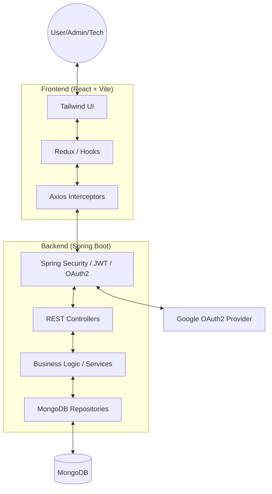

# SMART CAMPUS OPERATIONS HUB — Project Blueprint

## A. High-level project summary
**Smart Campus Operations Hub** is a centralized university operations platform to manage:
- **Facilities & assets catalogue** (bookable lecture halls, labs, meeting rooms, equipment)
- **Booking management** with conflict prevention and approval workflow
- **Maintenance & incident ticketing** with safe image uploads (max 3), technician assignment, status tracking, and comments
- **Notifications** for key events
- **Authentication & authorization** using **Google OAuth2** with **role-based access control** (USER/ADMIN/TECHNICIAN)

The system uses a professional layered architecture (DTOs, services, repositories, mappers), validation, global exception handling, consistent API responses, logging, environment-based configuration, and seed data.

---

## B. Final system modules
- **Module A – Facilities & Assets Catalogue**
  - Resource CRUD (admin), search/filter/pagination, user browse (active/available only)
- **Module B – Booking Management**
  - Booking request + workflow (PENDING/APPROVED/REJECTED/CANCELLED), conflict prevention, admin review actions
- **Module C – Maintenance & Incident Ticketing**
  - Tickets (OPEN→IN_PROGRESS→RESOLVED→CLOSED/REJECTED), attachments (≤3), comments, technician assignment and updates
- **Module D – Notifications**
  - Per-user notification inbox, read/unread, mark read/read-all
- **Module E – Authentication & Authorization**
  - Google OAuth2 login, persisted users, role management, backend endpoint protection + frontend route guards

---

## C. Backend architecture explanation
### Architecture style
- **Spring Boot REST API** with **layered architecture** and **DTO pattern**.
- **Controllers**: request/response only (no business logic).
- **Services**: business rules (conflict checks, workflows, ownership rules).
- **Repositories**: persistence (JPA + Specifications for filtering).
- **Mappers**: MapStruct (Entity ↔ DTO).
- **Validation**: Jakarta Validation on request DTOs.
- **Error handling**: Global `@ControllerAdvice` returning consistent error body.
- **Security**: Spring Security with OAuth2 login + role-based authorization.
- **Auditability**: created/updated timestamps + createdBy/updatedBy (where applicable), status transitions, approval metadata.

### System Architecture Diagram

### Packages (required structure)
`com.smartcampus`
- `config` (CORS, OpenAPI, audit, app properties)
- `controller` (REST controllers)
- `dto/request`, `dto/response`
- `entity` (JPA entities)
- `enums` (type/status enums)
- `exception` (custom exceptions + handler)
- `mapper` (MapStruct)
- `repository` (Spring Data MongoDB)
- `security` (OAuth2, JWT/session, RBAC)
- `service`, `service/impl`
- `specification` (filtering)
- `util` (helpers, file utilities)
- `SmartCampusApplication.java`

---

## D. Frontend architecture explanation
### Architecture style
- **React + Vite** with feature-based modular structure.
- **React Router** for routing.
- **Axios API layer** with interceptors (auth errors, response normalization).
- **State**: Redux Toolkit (scales cleanly for multi-module app).
- **UI**: Tailwind CSS (rapid, polished, consistent) + reusable component library.
- **Forms**: React Hook Form + Zod (schema validation).
- **Route protection**: role-based route guards (USER/ADMIN/TECHNICIAN).
- **Notifications**: polling (simple, viva-friendly) with “unread” badge.

---

## E. Database design
### Storage
- **MongoDB** for flexible, document-based storage.
- Enums stored as **Strings** (readable, stable) with application-level enums.

### Key relationships
- `users` → `roles` (many-to-one)
- `resources` → `bookings` (one-to-many)
- `resources` → `tickets` (one-to-many, optional)
- `tickets` → `ticket_attachments` (one-to-many)
- `tickets` → `ticket_comments` (one-to-many)
- `notifications` → `users` (many-to-one)
- `tickets.assigned_technician_id` → `users.id` (optional)

### Indexes (performance)
Indexes on:
- resource search: `(type, status, capacity, building)`
- bookings: `(resource_id, booking_date, start_time, end_time)` + status
- tickets: `(status, priority, created_at)` + assigned technician
- notifications: `(user_id, is_read, created_at)`

---

## F. Detailed entity list
### Core
- **Role**: id, name (USER/ADMIN/TECHNICIAN)
- **User**: id, email (unique), name, avatarUrl, roleId, provider, providerSubject, createdAt, updatedAt
- **Resource**: id, name, resourceCode (unique), type, description, capacity, building, floor, roomNumber, availabilityJson, status, createdAt/updatedAt, createdBy/updatedBy
- **Booking**: id, resourceId, userId, bookingDate, startTime, endTime, purpose, expectedAttendees, notes, status, decisionReason, decidedBy, decidedAt, createdAt/updatedAt
- **Ticket**: id, ticketNumber (unique), title, resourceId (nullable), locationText, category, description, priority, preferredContact, status, assignedTechnicianId (nullable), resolutionNotes, rejectionReason, createdAt/updatedAt/closedAt
- **TicketAttachment**: id, ticketId, originalFileName, storedFileName, contentType, sizeBytes, storagePath, uploadedBy, uploadedAt
- **TicketComment**: id, ticketId, authorId, body, createdAt, updatedAt, edited (boolean)
- **Notification**: id, userId, type, title, message, entityType, entityId, isRead, createdAt, readAt

---

## G. REST API endpoint list by module
Base path: **`/api/v1`**

### Auth & Users (Module E)
- `GET /users/me` (USER/ADMIN/TECHNICIAN)

### Admin user management (Module E)
- `GET /admin/users` (ADMIN)
- `PATCH /admin/users/{id}/role` (ADMIN)

### Resources (Module A)
- `GET /resources` (all roles; USER sees ACTIVE only)
- `GET /resources/{id}` (all roles; USER blocked if not ACTIVE)
- `POST /resources` (ADMIN)
- `PUT /resources/{id}` (ADMIN)
- `DELETE /resources/{id}` (ADMIN)

### Bookings (Module B)
- `POST /bookings` (USER/ADMIN)
- `GET /bookings` (USER own; ADMIN all with filters; TECHNICIAN optional)
- `GET /bookings/{id}` (owner or ADMIN)
- `PATCH /bookings/{id}/approve` (ADMIN)
- `PATCH /bookings/{id}/reject` (ADMIN)
- `PATCH /bookings/{id}/cancel` (owner or ADMIN)

### Tickets (Module C)
- `POST /tickets` (USER/ADMIN)
- `GET /tickets` (USER own; ADMIN all; TECHNICIAN assigned)
- `GET /tickets/{id}` (owner/admin/assigned tech)
- `PATCH /tickets/{id}/status` (ADMIN/TECHNICIAN; owner limited)
- `PATCH /tickets/{id}/assign-technician` (ADMIN)
- `POST /tickets/{id}/attachments` (owner/admin; max 3)
- `POST /tickets/{id}/comments` (owner/admin/assigned tech)
- `PUT /comments/{commentId}` (owner; ADMIN moderator)
- `DELETE /comments/{commentId}` (owner; ADMIN moderator)

### Notifications (Module D)
- `GET /notifications` (current user)
- `PATCH /notifications/{id}/read` (current user)
- `PATCH /notifications/read-all` (current user)

---

## H. Security design
### Login flow (OAuth2 + API authorization)
- Frontend triggers Google login via backend OAuth2 endpoint.
- Backend completes OAuth2, **persists user** (email/name/avatar/provider subject).
- Default role for new users: **USER**.
- Backend issues authenticated session (or JWT) and enforces role-based access using Spring Security.

### Authorization model
- **USER**: browse resources; create/view own bookings; create/view own tickets; comment where permitted; view own notifications
- **ADMIN**: full resource management; view/decide bookings; manage users/roles; manage tickets; assign technicians
- **TECHNICIAN**: view assigned tickets; update ticket status; add resolution notes/comments

### Hardening
- Strong CORS allowlist
- Server-side validation for all DTOs
- File upload: whitelist content types, size limit, random stored filenames, path traversal protection
- Ownership checks at service layer

---

## I. 4-member task allocation
- **Member 1 (Resources)**: Resource entity/DTO/spec/controller; resource pages + admin resource form
- **Member 2 (Bookings)**: Booking entity/DTO/service with conflict checks; booking pages (request, my bookings, admin review)
- **Member 3 (Tickets)**: Ticket/Attachment/Comment entities; secure uploads; ticket pages + comments UI
- **Member 4 (Auth/Notifications/CI)**: OAuth2 + RBAC + user/role admin; notifications module; GitHub Actions; integration glue

---

## J. Folder structure for backend and frontend
### Backend
See `backend/src/main/java/com/smartcampus/...` (matches required package structure).

### Frontend
See `frontend/src/...` (feature-based modules, reusable components, routing).

---

## K. Step-by-step implementation plan
1. Repo + CI + env templates + docs
2. DB schema + migrations + seed roles/users/resources
3. Backend base: response wrapper, exception handler, logging, validation
4. Security: OAuth2 login + persisted user + RBAC + `/users/me`
5. Module A resources (filters/specification, admin CRUD)
6. Module B bookings (conflict checks, workflows, audit fields)
7. Module C tickets (attachments/comments, technician workflow)
8. Module D notifications (emit on booking/ticket events, fetch/read endpoints)
9. Frontend: auth shell, layout, guards, pages + API integration per module
10. Tests: service unit tests + key endpoint integration tests
11. Innovation features (analytics dashboard, SLA timers, calendar view)

---

## L. GitHub Actions workflow
Workflow will:
- Build & test backend with Maven
- Install, lint, and build frontend with Node
- Cache dependencies

(Implemented in `.github/workflows/ci.yml`.)

---

